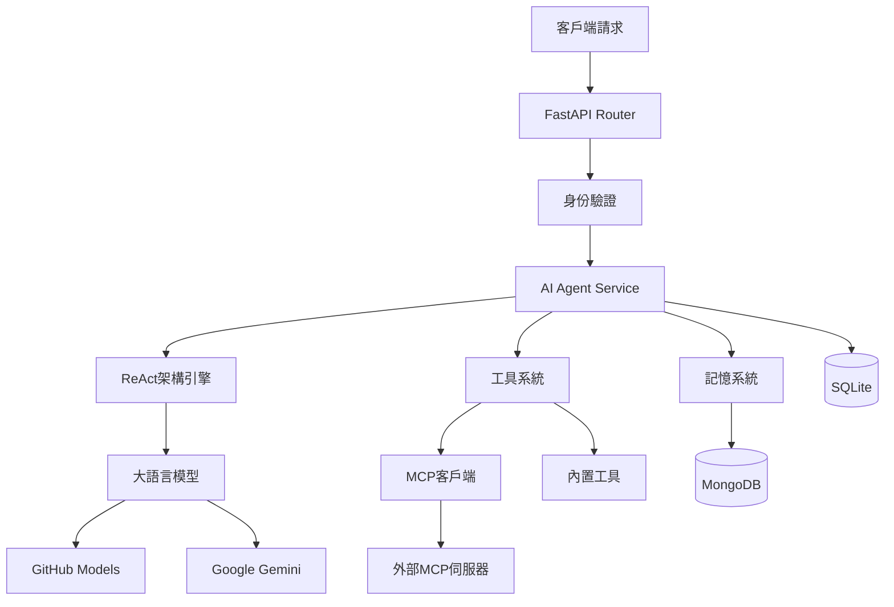

<div align="center">

# Castorice AI Agent API 伺服器

*基於 FastAPI 的下一代 AI Agent API SERVER*

[](https://python.org)
[](https://fastapi.tiangolo.com)
[](LICENSE)
[](docker-compose.yml)
[](https://mongodb.com)

**🔥 整合了ReAct架構的智能代理和Model Context Protocol (MCP)，提供完整的AI Agent調用解決方案**

<!-- [📖 快速開始](#⚡-快速開始) • [📚 API文檔](#📚-api-文檔) • [🛠️ 開發指南](#🛠️-開發指南) • [🤝 貢獻指南](#🤝-貢獻) -->

</div>

---
<p align="center">
  
</p>

## ✨ 為什麼選擇 Castorice？

🎯 **智能化**: 基於ReAct架構的自主決策與執行  
🔌 **可擴展**: MCP協議動態連接無限工具伺服器  
⚡ **高性能**: 非同步架構支援大規模併發處理  
🧠 **長記憶**: MongoDB存儲的持久化對話歷史  
🎨 **多模態**: 支援文字、圖像等多種內容生成  

## 🚀 核心特性

| 特性 | 描述 | 技術棧 |
|------|------|--------|
| 🤖 **智能代理系統** | 基於ReAct(推理-行動-反思)架構的自主Agent | ReAct Framework |
| 🔌 **MCP協議支援** | 完整實現Model Context Protocol，動態連接外部工具伺服器 | MCP v1.0 |
| 🧠 **多模型支援** | 支援Gemini、OpenAI等多種AI模型 | GitHub Models API, Gemini API |
| 💾 **長期記憶** | MongoDB存儲的用戶互動歷史和偏好記憶 | MongoDB Atlas |
| 🛠️ **豐富工具集** | 搜索、圖像生成、網頁抓取等內置工具 | Custom Tools |
| ⚡ **非同步架構** | 基於FastAPI和asyncio的高性能非同步處理 | FastAPI + asyncio |
| 🔒 **企業安全** | API密鑰認證、使用量控制、錯誤處理 | JWT + Rate Limiting |
| 🐳 **容器化部署** | 一鍵Docker部署| Docker|

## 🏗️ 技術架構



## 📋 技術棧

### 核心技術

| 層級 | 技術選型 | 版本要求 | 說明 |
|------|----------|----------|------|
| **Web框架** | FastAPI | 0.104+ | 高性能非同步Web框架 |
| **程式語言** | Python | 3.11+ | 現代Python特性支援 |
| **資料庫** | MongoDB + SQLite | Latest | 分散式+本地存儲 |
| **AI模型** | GitHub Models, Gemini | Latest API | 多模型支援 |
| **Agent架構** | ReAct | Custom | 推理-行動-反思循環 |
| **協議支援** | MCP | v1.0 | Model Context Protocol |
| **容器化** | Docker + Compose | Latest | 一鍵部署方案 |


## ⚡ 快速開始

### 📋 系統要求

- **Python**: 3.11+
- **記憶體**: 至少 1GB RAM
- **磁碟**: 至少 2GB 可用空間
- **網路**: 穩定的網際網路連接（用於api調用）

### 🛠️ 安裝方式

<details>
<summary><b>方式一：Docker 部署（推薦）</b></summary>

```bash
# 克隆專案
git clone https://github.com/your-org/castorice-ai-agent.git
cd castorice-ai-agent

# 配置環境變數
cp .env.example .env
# 編輯 .env 文件，填入你的API密鑰

# 一鍵啟動
docker-compose up -d

# 查看日誌
docker-compose logs -f
```

</details>

<details>
<summary><b>方式二：本地開發</b></summary>

```bash
# 建立虛擬環境
python -m venv venv
source venv/bin/activate  # Windows: venv\Scripts\activate

# 安裝依賴
pip install -r requirements.txt

# 建立配置文件
cp .env.example .env

# 啟動開發伺服器
uvicorn main:app --reload --host 0.0.0.0 --port 8000
```

</details>

### 1. 環境配置

### 🔑 環境變數配置

建立 `.env` 文件並配置以下變數：

```env
# 資料庫配置
MONGODB_URL=mongodb://mongo:27017/agent
SQLITE_DB=./data/chatlog.db

# GitHub Model LLM API密鑰
GITHUB_INFERENCE_KEY=your_GITHUB_TOKEN_here
GITHUB_ENDPOINT=https://models.inference.ai.azure.com
GITHUB_API_VERSION=2025-04-01-preview

# Gemini API配置
GEMINI_API_KEY=your_gemini_api_key_here
GEMINI_DEFAULT_MODEL=gemini-2.5-flash-preview-05-20

# 工具配置
CLOUDFLARE_API_KEY=your_cloudflare_key_here
CLOUDFLARE_ACCOUNT_ID=your_cloudflare_account_id_here

# API認證
ADMIN_API_KEY=change_this_to_a_secure_random_string

# 調試模式
DEBUG=true

``` 

💡 **提示**: 將 `.env.example` 複製為 `.env` 後修改配置值

### 🚀 啟動服務

```bash
# 方式一：開發模式
uvicorn main:app --reload --host 0.0.0.0 --port 8000

# 方式二：生產模式
uvicorn main:app --host 0.0.0.0 --port 8000 --workers 4

# 方式三：Docker Compose
docker-compose up -d

```

### ✅ 驗證部署

訪問以下連結驗證服務是否正常運行：

| 服務 | URL | 描述 |
|------|-----|------|
| 🏠 **主頁** | http://localhost:8000 | 服務主頁 |
| 📖 **API文檔** | http://localhost:8000/docs | Swagger UI 文檔 |
| 🔍 **ReDoc文檔** | http://localhost:8000/redoc | ReDoc 文檔 |
| ❤️ **健康檢查** | http://localhost:8000/health | 系統狀態檢查 |
| 📊 **監控面板** | http://localhost:8000/metrics | 性能指標 |


## 🎯 API 使用指南

### 🤖 智能Agent對話

<details>
<summary><b>基礎Agent對話</b></summary>

```bash
curl --location 'http://localhost:8000/api/v1/agent' \
--header 'Content-Type: application/json' \
--header 'X-API-KEY: test_api_key' \
--data '{
    "prompt": "幫我透過mcp server查詢PostgreSQL中chat/title部分的內容",
    "user_id": "user123",
    "model_name": "gpt-4o-mini",
    "enable_memory": true,
    "enable_reflection": true,
    "enable_mcp": true,
    "max_steps": 5,
    "confidence_threshold": 0.8
}'
```
</details>

### 💬 OpenAI 兼容接口

<details>
<summary><b>Chat Completions API</b></summary>

```bash
curl --location 'http://localhost:8000/api/v1/chat/completions' \
--header 'accept: application/json' \
--header 'Content-Type: application/json' \
--header 'X-API-KEY: test_api_key' \
--data '{
  "messages": [
    {
      "role": "user", 
      "content": "幫我透過mcp server查詢PostgreSQL中[title]的內容"
    }
  ],
  "model": "gpt-4o-mini",
  "user_id": "test_user",
  "enable_search": true,
  "language": "zh-TW",
}'
```
</details>

### 📚 記憶與歷史管理

<details>
<summary><b>歷史記錄查詢</b></summary>

```bash
# 獲取用戶對話歷史（支援分頁）
curl --location 'http://127.0.0.1:8000/api/v1/history/test?limit=10' \
```
</details>


<details>
<summary><b>記憶管理</b></summary>

```bash
# 獲取用戶記憶
curl --location 'http://127.0.0.1:8000/api/v1/memory/test' \
--header 'accept: application/json' \
--header 'X-API-KEY: test_api_key'
```
</details>

### 📊 監控與統計

<details>
<summary><b>使用統計</b></summary>

```bash
# 獲取用戶使用統計
curl --location 'http://127.0.0.1:8000/api/v1/usage/test' \
--header 'accept: application/json' \
--header 'X-API-KEY: test_api_key'
```

</details>

<!-- ## 🤖 API 调用示例

## 📚 完整文档

| 文档类型 | 链接 | 描述 |
|----------|------|------|
| 🚀 **快速开始** | [Getting Started](docs/getting-started.md) | 5分钟快速上手指南 |
| 🏗️ **架构设计** | [Technical Architecture](docs/Technical_Architecture.md) | 系统架构与设计理念 |
| 🤖 **Agent技术** | [Agent Documentation](docs/Agent_Technical_Documentation.md) | ReAct架构和Agent实现详解 |
| 🔌 **MCP协议** | [MCP Documentation](docs/MCP_Technical_Documentation.md) | Model Context Protocol集成指南 |
| 📖 **API参考** | [http://localhost:8000/docs](http://localhost:8000/docs) | 完整的API接口文档 |
| 🛠️ **开发指南** | [Development Guide](docs/Development_Guide.md) | 开发环境配置与最佳实践 |
| 📝 **更新日志** | [CHANGELOG](docs/CHANGELOG.md) | 版本更新记录 |

### 📖 在线文档

- **Swagger UI**: [http://localhost:8000/docs](http://localhost:8000/docs) - 交互式API文档
- **ReDoc**: [http://localhost:8000/redoc](http://localhost:8000/redoc) - 美观的API文档
- **健康检查**: [http://localhost:8000/health](http://localhost:8000/health) - 服务状态监控 -->


## 📚 文檔

- [Agent技術文檔](docs/Agent_Technical_Documentation.md) - ReAct架構和Agent實現詳解
- [MCP技術文檔](docs/MCP_Technical_Documentation.md) - Model Context Protocol整合指南
- [API參考](http://localhost:8000/docs) - 完整的API接口文檔

## 🏗️ 項目架構

<!-- ```
📦 castorice-ai-agent/
├── 🔧 app/                     # 应用核心代码
│   ├── 💎 core/               # 核心配置模块
│   │   ├── config.py          # 应用配置管理
│   │   ├── dependencies.py    # 依赖注入
│   │   └── mcp_config.py      # MCP配置管理
│   │
│   ├── 📊 models/             # 数据模型定义
│   │   ├── mongodb.py         # MongoDB模型
│   │   ├── sqlite.py          # SQLite模型
│   │   └── agent_models.py    # Agent专用模型
│   │
│   ├── 🛣️ routers/            # API路由定义
│   │   ├── api.py             # 通用API路由
│   │   ├── agent.py           # Agent API路由
│   │   ├── mcp.py             # MCP管理路由
│   │   └── collaboration.py   # 协作功能路由
│   │
│   ├── 🔧 services/           # 业务逻辑层
│   │   ├── agent_service.py    # 🤖 Agent核心服务
│   │   ├── mcp_client.py       # 🔌 MCP客户端服务  
│   │   ├── llm_service.py      # 🧠 大语言模型服务
│   │   ├── memory_service.py   # 💾 记忆管理服务
│   │   └── agent_collaboration.py # 🤝 多Agent协作
│   │
│   └── 🛠️ utils/              # 工具函数库
│       ├── logger.py          # 日志管理
│       ├── tools.py           # 内置工具集
│       └── helpers.py         # 辅助函数
│
├── 📊 data/                   # 数据存储目录
│   ├── agent.db              # SQLite数据库
│   ├── mcp_servers.json      # MCP服务器配置
│   ├── usage.json            # 使用统计数据
│   └── images/               # 生成图片存储
│
├── 📚 docs/                   # 技术文档
│   ├── Agent_Technical_Documentation.md
│   ├── MCP_Technical_Documentation.md
│   ├── Technical_Architecture.md
│   ├── Development_Guide.md
│   └── CHANGELOG.md
│
├── 📈 logs/                   # 日志文件
├── 🧪 scripts/               # 辅助脚本
├── 🐳 docker-compose.yml     # Docker编排文件
├── 📦 requirements.txt       # Python依赖
└── ⚙️ pyproject.toml         # 项目配置 -->
```
app/
├── core/           # 核心配置和依賴
├── models/         # 資料模型定義
├── routers/        # API路由
├── services/       # 業務邏輯服務
│   ├── agent_service.py    # Agent核心服務
│   ├── mcp_client.py       # MCP客戶端
│   └── llm_service.py      # LLM服務
└── utils/          # 工具函數
data/
├── mcp_servers.json        # MCP伺服器配置
└── images/                 # 生成的圖片存儲
docs/               # 技術文檔
```
### 🔍 核心模組說明

| 模組 | 職責 | 技術特點 |
|------|------|----------|
| **Agent Service** | 智能代理核心邏輯 | ReAct架構、多步推理 |
| **MCP Client** | 外部工具連接 | 動態發現、錯誤恢復 |
| **LLM Service** | 模型調用管理 | 多模型支援、負載均衡 |
| **Memory Service** | 記憶存儲管理 | 向量檢索、語義搜索 |
| **Tool System** | 工具調用框架 | 外掛化、類型安全 |

## ⚙️ 高級配置

### 🔧 MCP伺服器配置

在 `data/mcp_servers.json` 中配置外部工具伺服器：

```json
{
  "mcpServers": {
    "github": {
      "command": "npx",
      "args": ["-y", "@modelcontextprotocol/server-github"],
      "env": {
        "GITHUB_PERSONAL_ACCESS_TOKEN": "your_token"
      },
      "enabled": true
    }
  }
}
```

### 📋 貢獻類型

| 類型 | 描述 | 示例 |
|------|------|------|
| 🐛 **Bug修復** | 修復現有功能的問題 | 修復Agent無限循環 |
| ✨ **新功能** | 添加新的功能特性 | 新增圖像分析工具 |
| 📚 **文檔改進** | 改進文檔和示例 | 添加API使用示例 |
| 🔧 **工具整合** | 整合新的MCP工具 | 添加Slack整合 |
| ⚡ **性能優化** | 提升系統性能 | 優化資料庫查詢 |
| 🧪 **測試增強** | 增加測試覆蓋 | 添加整合測試 |

### 🎯 開發路線圖

<details>
<summary><b>近期計劃 (Q3 2025)</b></summary>

- [ ] **Agent協作系統** - 多Agent協同工作
- [ ] **可視化界面** - Web UI管理面板  
- [ ] **性能優化** - 併發處理能力提升
- [ ] **企業功能** - SSO、審計日誌、權限控制

</details>


### 🏆 貢獻者認可

感謝所有為項目做出貢獻的開發者！

[](https://github.com/yuhuanowo/Castorice-LLM-Service/graphs/contributors)

### 📞 聯繫我們

- 📧 **郵箱**: huhu11256@gmail.com
- 💬 **Discord**: [YuhuanStudio](https://discord.com/invite/GfUY7ynvXN)
- 🌐 **官網**: [YuhuanStudio](https://www.yuhuanstudio.com)

---

## 📄 許可證

本項目採用 **MIT License** 開源協議 - 詳見 [LICENSE](LICENSE) 文件

---

<!-- <div align="center">

## 🌟 如果這個項目對你有幫助，請給我們一個 Star！

[](https://star-history.com/#yuhuanowo/Castorice-LLM-Service&Date) -->

<!-- **最新更新 (2025年5月24日)**
- ✅ 完善ReAct架構Agent實現
- ✅ 優化MCP客戶端穩定性  
- ✅ 增強工具調用和錯誤處理
- ✅ 改進記憶管理和資源清理
- ✅ 完善開發者文檔

--- -->
<div align="center">
*Built with ❤️ by the YuhuanStudio Team*

</div>
